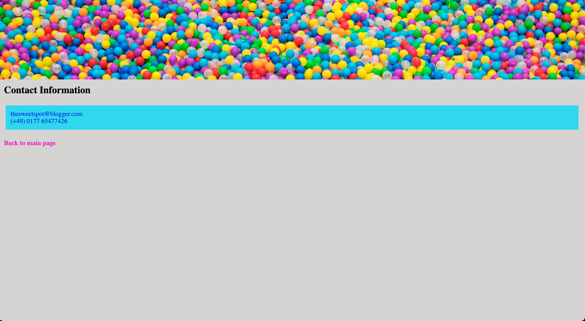

# The Sweet Spot v3

Let's continue to improve **The Sweet Spot** by applying some semantic HTML as well as `padding` and `margin` to space things out a bit. Have a look at **v3** below -

#### Main Page

#### Contact Page

### Instructions

> - Refactor v2 using **semantic HTML** - `section`, `article`, `header`, `footer` etc..
> - Apply `margin` and `padding`
> - Change the banner images on the main and contact pages to **background images**
> - Make sure to do apply a soft **CSS Reset** to the page
> - If you need more dummy text, here is the link - http://www.cupcakeipsum.com/
> - Take a few moments to check out the [live version]( https://digitalcareerinstitute.github.io/UIB-box-model-the-sweet-spot-v3/) and apply the same hover styling on the list items as shown
> - As always, try to make your webpage as pixel-perfect to the references as possible
